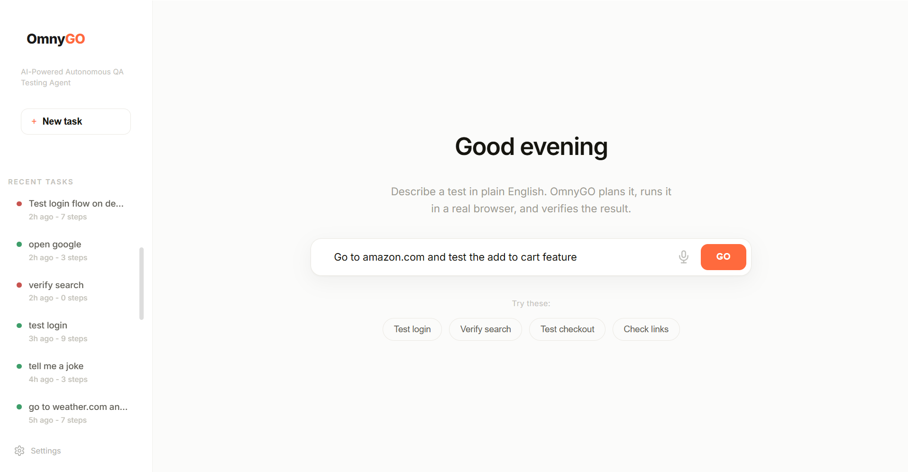
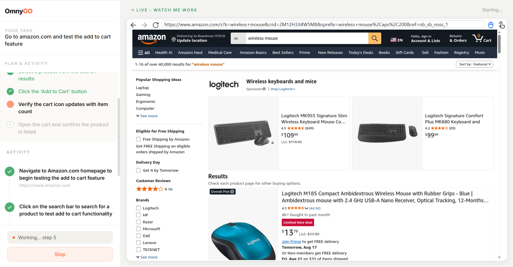
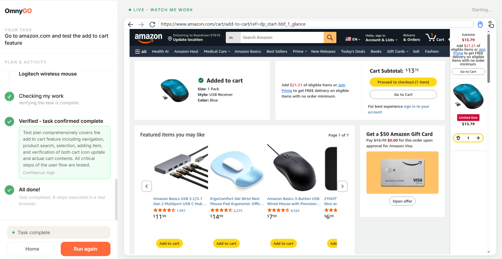
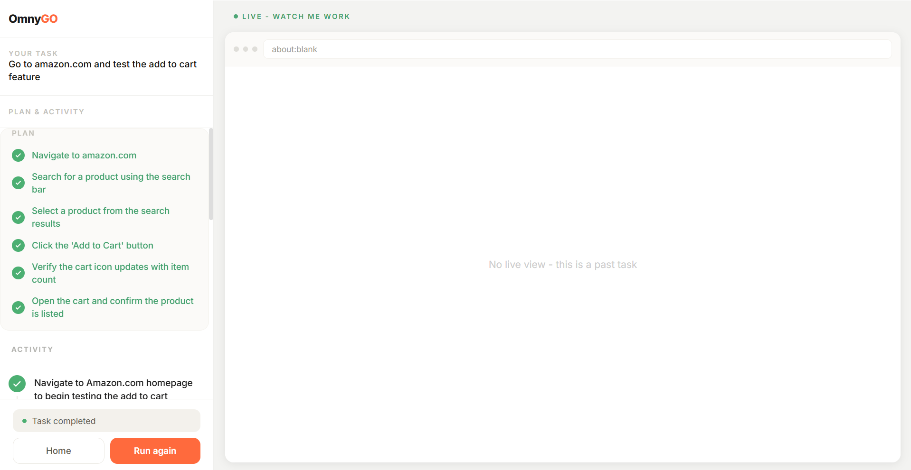

<div align="center">

# OmnyGO

### Describe a test in plain English. Watch it run in a real browser.

**[→ Try it live](https://omnygo-vercel.vercel.app)** &nbsp;•&nbsp; **[→ Source](https://github.com/deeraj-pw/omnygo-vercel)**

</div>

---

## Every QA team knows this feeling

You write a test script. It works.

Someone moves a button. It breaks.

You fix the selector. It works again.

Someone renames a class. It breaks again.

You are not testing software anymore. You are maintaining a second codebase whose only job is to describe the first one — and it rots faster than the thing it describes.

Meanwhile, the tests nobody automated get done by hand. Same clicks. Same forms. Same login. Every release. Forever.

I built this because I watched that happen every sprint and kept thinking the same thing:

**The problem isn't that testing is hard. It's that describing a test to a computer is hard.**

A human tester doesn't need a selector. They look at the screen and find the login button, even after you move it.

So what if the tester could just *look at the screen*?

---

## So here are three things

**A planner.** An AI that reads your test in plain English and breaks it into real steps — before it touches anything.

**A driver.** A real Chromium browser in the cloud that clicks, types, scrolls, and navigates like a person. Not a simulation. An actual browser.

**A verifier.** A second AI that looks at the final screen and honestly answers one question: *did that actually work?*

A planner. A driver. A verifier.

**These are not three tools. This is one agent. And it's called OmnyGO.**

---

## Here's the whole thing

You type:

> *Test the login flow on saucedemo.com with valid credentials*

You press GO.

OmnyGO writes a plan — six steps, on screen, before it does anything. Then a real browser opens and starts working. Navigate to the site. Click the username field. Type the username. Click the password field. Type the password. Submit.

Then it stops and checks its own work. Not *"I finished."* — **"Here is what I see on the screen, and here is whether it matches what you asked for."**

That's the product.

**No scripts. No selectors. No maintenance.**

---

## And you watch all of it

This is the part that took the longest to build, and the part that matters most.

The browser isn't hidden. It isn't a log file you read afterward. It isn't a recording.

**It's streaming, live, inside the dashboard, while it happens.**

You see the real page load. You see the cursor land on the real button. You see the text appear character by character in the real form field. When something goes wrong, you don't read about it — you watch it go wrong, and you know exactly which step broke and why.

Most agent demos show you a transcript and ask you to trust it. This one shows you the browser.

That changes what the tool is for. It stops being a black box that emits a pass/fail, and becomes something you can actually supervise — which is exactly what AI agents need right now.

---

## It knows when to ask you

Here is something OmnyGO will never do: **guess at your password.**

When it hits a login wall, a payment field, or anything that needs information only you have, it stops. It shows you the question. It waits.

That was a deliberate design decision, and it came from a bug. In an early build, the agent reached a login page, decided to be helpful, and filled the fields with invented credentials. It looked like it was working. It wasn't. It was confidently doing the wrong thing.

So now the rule is explicit in the agent's instructions: **when you need something only the human has, ask — never assume.**

That's the human-in-the-loop, and it's not a limitation. An agent that knows the boundary of its own competence is more useful than one that pretends it doesn't have one.

---

## Why the verifier matters

Any agent can claim success. Most do.

An agent that navigates to a page, misses the actual goal, and reports *"Task completed successfully"* is worse than no agent at all — because now you trust a green check that means nothing.

So OmnyGO does the one thing that makes automation trustworthy: **before declaring victory, it looks again.** Fresh screenshot. Independent judgment. A confidence rating and a written reason you can read.

If it didn't actually work, it says so, and goes back to work.

That's the difference between automation and an agent you can trust.

---

## What this actually saves you

| | Traditional automation | OmnyGO |
|---|---|---|
| **Writing a new test** | 30–60 min of scripting | 10 seconds of typing |
| **When the UI changes** | Find and fix broken selectors | Nothing — it reads the new screen |
| **Ongoing maintenance** | Permanent, grows with the suite | None |
| **Who can write tests** | Someone who codes | Anyone who can describe the test |
| **Knowing a pass is real** | Trust the assertion | Independently verified with evidence |

The last row is the one people underestimate. A test suite that passes for the wrong reason costs more than no suite at all.

---

## What makes it agentic

| | |
|---|---|
| **Plans before it acts** | Reasons about the whole journey, not just the next click |
| **Adapts mid-task** | Reality differs from the plan? It adjusts and keeps going |
| **Notices when it's stuck** | Repeating itself? It changes approach instead of looping |
| **Knows when to ask** | Hits a credential wall, it stops and asks — never guesses |
| **Checks its own work** | Verification is a separate step with independent judgment |

---

## Tech Stack

| Layer | Choice | Why |
|---|---|---|
| **Intelligence** | Anthropic Claude (`claude-sonnet-4-5`) | Vision + reasoning in one model — it reads screens like a person |
| **Browser** | Browserbase + Playwright | Real Chromium in the cloud, with a streamable live view |
| **Backend** | Vercel Serverless Functions | Four small endpoints, no server to run |
| **Frontend** | Vanilla HTML / CSS / JS | Single file, zero build step, loads instantly |
| **Protocol** | Chrome DevTools Protocol | How the agent and the live view both reach the browser |

---

## Architecture

```
                        You type a test
                              │
                              ▼
                  ┌───────────────────────┐
                  │   Vercel (Frontend)   │
                  │   public/index.html   │
                  └───────────┬───────────┘
                              │
          ┌───────────────────┼───────────────────┐
          ▼                   ▼                   ▼
   ┌─────────────┐     ┌─────────────┐     ┌─────────────┐
   │ /api/plan   │     │/api/run-task│     │ /api/verify │
   │             │     │             │     │             │
   │ Claude      │     │ Claude sees │     │ Claude looks│
   │ writes the  │     │ screen →    │     │ at the final│
   │ test plan   │     │ picks action│     │ screen and  │
   │             │     │             │     │ judges it   │
   └─────────────┘     └──────┬──────┘     └─────────────┘
                              │ CDP
                              ▼
                  ┌───────────────────────┐
                  │  Browserbase Cloud    │
                  │   Real Chromium       │
                  └───────────┬───────────┘
                              │
                              ▼
                        Any website
                              │
                              ▼
                    Live view streams back
```

**The loop:** screenshot → Claude decides one action → browser executes it → screenshot again. Repeat until done. Then verify.

The live view is a separate stream straight from the browser to your screen — it costs nothing and never passes through the AI.

---

## Screenshots

**Describe what you want tested**



**The agent writes its plan before touching anything**



**A real browser, streaming live, doing the work**


**It checks its own work and tells you what it sees**



**Every run saved, reviewable, rerunnable**



---

## How to Run

### Try it live — nothing to install

**[https://omnygo-vercel.vercel.app](https://omnygo-vercel.vercel.app)**

Type a test. Press GO. That's the whole onboarding.

Suggested first tries:

```
Verify search returns results on wikipedia.org
Test the login flow on saucedemo.com with valid credentials
Check that the product listing page loads on saucedemo.com
Go to weather.com and tell me the weather in Brussels
```

### Run it yourself

**Prerequisites:** Node.js 18+, an Anthropic API key, a Browserbase account (free tier works)

```bash
git clone https://github.com/deeraj-pw/omnygo-vercel.git
cd omnygo-vercel
npm install
```

Create `.env` in the project root:

```env
ANTHROPIC_API_KEY=sk-ant-your-key
BROWSERBASE_API_KEY=bb-your-key
BROWSERBASE_PROJECT_ID=your-project-id
```

Start it:

```bash
vercel dev
```

Open `http://localhost:3000`.

### Bring your own key

Don't want to use the demo key? Open **Settings** and paste your own Anthropic key. It stays in your browser and never touches the server.

---

## Project Structure

```
omnygo-vercel/
├── api/
│   ├── plan.js         # Claude writes the test plan
│   ├── run-task.js     # Browser session + the agent loop
│   ├── simulate.js     # Plain-English step narration
│   └── verify.js       # Independent completion check
├── public/
│   └── index.html      # The entire dashboard, one file
├── vercel.json
├── package.json
└── README.md
```

Four endpoints. One page. That's the codebase.

---

## What it doesn't do yet

Being honest is more useful than being impressive.

- **CAPTCHAs stop it.** Sites with aggressive bot protection will block the agent. By design it tells you rather than trying to defeat them.
- **Deep enterprise apps are hard.** Dense custom UIs with non-standard widgets sometimes need a nudge.
- **Free tier limits apply.** Browserbase free tier allows 3 concurrent sessions.
- **It costs credits.** Every step is an API call. Simple tests are cheap; long ones add up.

None of these are hidden inside the product either. When OmnyGO can't do something, it tells you what stopped it.

---

## What's next

- **Memory across runs** — learn an app's layout once, navigate it faster forever
- **Test suites** — queue ten scenarios, come back to a report
- **Exportable reports** — hand a document to your lead, not a screenshot
- **Exploratory mode** — point it at a URL and let it hunt for bugs on its own

---

## On how this was built

Built with AI-assisted development. The architecture, the product decisions, the UX, the debugging, and every judgment call about what was right and what was wrong are mine. The code was written with AI as a very fast pair of hands.

That's how software gets built now. Saying so plainly seemed better than pretending otherwise.

---

<div align="center">

### One more thing

Every test you run is saved — the plan, every step, the verification, the result.

Click any past run to see exactly what happened. Click **Run again** to do it once more.

Your test suite isn't a folder of scripts anymore.

**It's a history of things you asked for, in English.**

<br>

**[→ Try OmnyGO](https://omnygo-vercel.vercel.app)**

<br>

*Built for the AI Tester 3X Hackathon*

MIT License

</div>
